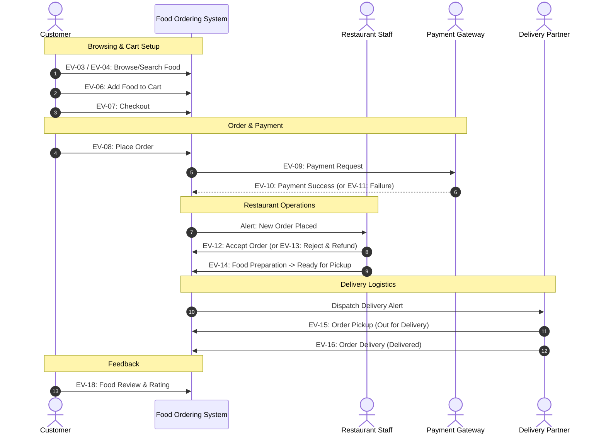

# SYSTEM EVENT LIST & EVENT TABLE
## ONLINE FOOD ORDERING SYSTEM

---

### Document Control
* **Project Name:** Online Food Ordering System
* **Course:** Object-Oriented Analysis and Design (OOAD)
* **Phase:** Review 1 — Requirements Specification (Event-Driven Modeling)
* **Status:** Finalized

---

## 1. SYSTEM EVENT LIST

The system processes **18 core business and lifecycle events** initiated by the system's actors (Customer, Restaurant Staff, Delivery Partner, and Payment Gateway) and system timers.

```
+----------------------------------------------------------------------------------------------------+
|                                    EVENT IDENTIFIER LIST                                           |
+--------+------------------------------------+--------+---------------------------------------------+
| ID     | Event Name                         | ID     | Event Name                                  |
+--------+------------------------------------+--------+---------------------------------------------+
| EV-01  | Customer Registration              | EV-10  | Payment Success                             |
| EV-02  | Customer Login                     | EV-11  | Payment Failure                             |
| EV-03  | Restaurant Selection               | EV-12  | Restaurant Accepts Order                    |
| EV-04  | Food Search                        | EV-13  | Restaurant Rejects Order                    |
| EV-05  | Food Selection                     | EV-14  | Food Preparation                            |
| EV-06  | Add Food to Cart                   | EV-15  | Order Pickup                                |
| EV-07  | Checkout                           | EV-16  | Order Delivery                              |
| EV-08  | Place Order                        | EV-17  | Order Cancellation                          |
| EV-09  | Payment Request                    | EV-18  | Food Review                                 |
+--------+------------------------------------+--------+---------------------------------------------+
```

---

## 2. SYSTEM EVENT TABLE

| Event ID | Event Name | Source (Actor) | Trigger | Input Data | System Response | Output Data |
| :--- | :--- | :--- | :--- | :--- | :--- | :--- |
| **EV-01** | **Customer Registration** | Customer | Submits completed registration form | Name, email, password, phone, delivery address | Validates field formats, encrypts password, creates customer profile in database | Registration confirmation message, user ID |
| **EV-02** | **Customer Login** | Customer / Staff / Partner | Submits login credentials | Email / Username, Password, Role | Verifies credentials against database, initializes authenticated session token | Authentication token, personalized dashboard view |
| **EV-03** | **Restaurant Selection** | Customer | Clicks on a restaurant card | Restaurant ID | Queries database for restaurant profile, operating status, and active menu items | Restaurant details view, categorized menu list |
| **EV-04** | **Food Search** | Customer | Types search keyword in search bar | Search keyword (food name, category, or cuisine) | Executes text search against active menu items database | List of matching food items with prices and restaurant tags |
| **EV-05** | **Food Selection** | Customer | Clicks on a specific food item | Food Item ID | Retrieves food item description, pricing, ingredients, and availability | Food item detail view / modal |
| **EV-06** | **Add Food to Cart** | Customer | Clicks "Add to Cart" button | Food Item ID, Quantity, Restaurant ID | Validates restaurant consistency, creates/updates cart record, recalculates item subtotal | Updated cart item count, cart drawer view |
| **EV-07** | **Checkout** | Customer | Clicks "Proceed to Checkout" button | Cart ID, Customer ID, Selected Delivery Address | Validates cart has $\ge 1$ item, calculates item total, taxes, delivery fee, and grand total | Order checkout summary screen, breakdown bill |
| **EV-08** | **Place Order** | Customer | Clicks "Place Order & Pay" button | Cart ID, Delivery Address, Contact Number, Payment Mode | Creates a new `Order` entity in `PENDING_PAYMENT` status, creates order line items, initializes payment gateway request | Order ID, redirection to Payment Gateway interface |
| **EV-09** | **Payment Request** | Customer / System | Submits payment details on payment page | Order ID, Amount, Card/UPI/Wallet details | Formats and securely transmits encrypted transaction request to external Payment Gateway | Payment processing spinner / status |
| **EV-10** | **Payment Success** | Payment Gateway | Payment is authorized successfully | Transaction Reference ID, Approval Status, Order ID | Updates `Payment` record to `SUCCESS`, updates `Order` status to `PLACED` / `CONFIRMED`, triggers alert to restaurant | Payment receipt, order confirmation screen with tracking ID |
| **EV-11** | **Payment Failure** | Payment Gateway | Payment transaction is declined or timed out | Error Code, Decline Reason, Order ID | Records failed payment attempt, maintains order in `PAYMENT_FAILED` state, logs failure | Error message banner with "Retry Payment" / "Change Payment Method" options |
| **EV-12** | **Restaurant Accepts Order** | Restaurant Staff | Clicks "Accept Order" on kitchen dashboard | Order ID, Estimated Preparation Time | Updates `Order` status from `PLACED` to `ACCEPTED`, adds order to kitchen queue, alerts delivery dispatch | Order accepted status update notification to customer |
| **EV-13** | **Restaurant Rejects Order** | Restaurant Staff | Clicks "Reject Order" on kitchen dashboard | Order ID, Rejection Reason | Updates `Order` status to `REJECTED`, dispatches automated refund request to Payment Gateway | Order rejection notification to customer, refund confirmation |
| **EV-14** | **Food Preparation** | Restaurant Staff | Updates kitchen stage / clicks "Ready for Pickup" | Order ID, Status (`PREPARING` / `READY_FOR_PICKUP`) | Updates `Order` status to `READY_FOR_PICKUP`, matches order with assigned delivery partner | Kitchen status update notification, pickup alert to delivery partner |
| **EV-15** | **Order Pickup** | Delivery Partner | Clicks "Confirm Pickup" at restaurant | Order ID, Delivery Partner ID | Verifies pickup, updates `Order` status to `OUT_FOR_DELIVERY`, activates live tracking | Pickup notification to customer, route navigation to delivery partner |
| **EV-16** | **Order Delivery** | Delivery Partner | Clicks "Mark as Delivered" at customer doorstep | Order ID, Delivery Confirmation / Timestamp | Updates `Order` status to `DELIVERED`, closes delivery task, unlocks rating & review form | Delivery completion notification, final invoice, review prompt |
| **EV-17** | **Order Cancellation** | Customer | Clicks "Cancel Order" on active order tracking page | Order ID, Cancellation Reason | Verifies order is in `PLACED` or `ACCEPTED` state (not `PREPARING`), updates status to `CANCELLED`, triggers automated full refund via Payment Gateway | Order cancellation confirmation, refund reference ID |
| **EV-18** | **Food Review** | Customer | Submits star rating and feedback comments | Order ID, Restaurant ID, Rating (1–5 Stars), Review Comment | Validates that order status is `DELIVERED`, stores review entity, updates restaurant overall average rating | Review published confirmation, updated restaurant rating |

---

## 3. EVENT-TO-ACTOR TRACEABILITY MATRIX

```
+------------------------------------+----------+------------------+------------------+-----------------+
| Event Name                         | Customer | Restaurant Staff | Delivery Partner | Payment Gateway |
+------------------------------------+----------+------------------+------------------+-----------------+
| EV-01: Customer Registration       |    X     |                  |                  |                 |
| EV-02: Customer Login              |    X     |        X         |        X         |                 |
| EV-03: Restaurant Selection        |    X     |                  |                  |                 |
| EV-04: Food Search                 |    X     |                  |                  |                 |
| EV-05: Food Selection              |    X     |                  |                  |                 |
| EV-06: Add Food to Cart            |    X     |                  |                  |                 |
| EV-07: Checkout                    |    X     |                  |                  |                 |
| EV-08: Place Order                 |    X     |                  |                  |                 |
| EV-09: Payment Request             |    X     |                  |                  |        X        |
| EV-10: Payment Success             |          |                  |                  |        X        |
| EV-11: Payment Failure             |          |                  |                  |        X        |
| EV-12: Restaurant Accepts Order    |          |        X         |                  |                 |
| EV-13: Restaurant Rejects Order    |          |        X         |                  |        X (Refund)
| EV-14: Food Preparation            |          |        X         |                  |                 |
| EV-15: Order Pickup                |          |                  |        X         |                 |
| EV-16: Order Delivery              |          |                  |        X         |                 |
| EV-17: Order Cancellation          |    X     |                  |                  |        X (Refund)
| EV-18: Food Review                 |    X     |                  |                  |                 |
+------------------------------------+----------+------------------+------------------+-----------------+
```

---

## 4. EVENT LIFECYCLE ORDER FLOW (CORE USE-CASE TIMELINE)



---
*This Event Table and Traceability Matrix serves as the event-driven foundation for constructing the Use Case Diagram, Sequence Diagrams, Activity Diagrams, and State Machine Diagrams.*
