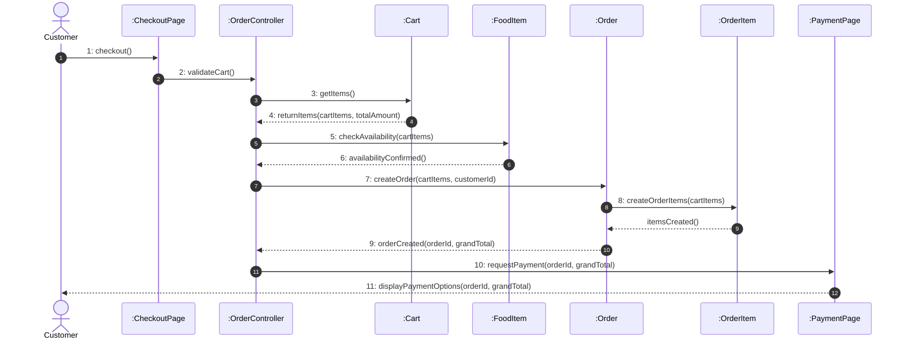

# OBJECT-ORIENTED ANALYSIS AND DESIGN (OOAD)
# LABORATORY EXPERIMENT MANUAL & DOCUMENTATION

---

### Project Title:
## **ONLINE FOOD ORDERING SYSTEM**

* **Academic Course:** Object-Oriented Analysis and Design (OOAD) / Software Engineering Laboratory
* **Degree Program:** B.Tech / B.E. in Computer Science & Engineering
* **Phase:** Complete Laboratory Portfolio (Experiments 1 through 6)
* **Modeling Tools:** diagrams.net / draw.io, UML 2.5 Specification

---

# TABLE OF CONTENTS
1. [LAB EXPERIMENT 1: OOAD Fundamentals & UML Tool Familiarization](#lab-experiment-1)
2. [LAB EXPERIMENT 2: Requirement Engineering & Event Modeling](#lab-experiment-2)
3. [LAB EXPERIMENT 3: Use Case Modeling & Specifications](#lab-experiment-3)
4. [LAB EXPERIMENT 4: Domain Analysis & Class Design](#lab-experiment-4)
5. [LAB EXPERIMENT 5: Object Interaction Modeling (System Sequence Diagrams)](#lab-experiment-5)
6. [LAB EXPERIMENT 6: Detailed Object Design (BCE Architecture & Communication Diagrams)](#lab-experiment-6)

---

# LAB EXPERIMENT 1
## OOAD Fundamentals & UML Tool Familiarization

### 1.1 Objective
To understand the foundational principles of Object-Oriented Analysis and Design (OOAD), explore the Software Development Life Cycle (SDLC), master the core concepts of object orientation (Encapsulation, Abstraction, Inheritance, Polymorphism, Relationships), and become proficient with UML modeling tools using the **Online Food Ordering System** as the running domain example.

---

### 1.2 Software Development Life Cycle (SDLC) & OOAD
The Software Development Life Cycle (SDLC) provides a systematic framework for planning, analyzing, designing, building, testing, and deploying software systems. 

```
+-------------------------------------------------------------------------------+
|                             SDLC & OOAD STAGES                                |
+------------------+-------------------+--------------------+-------------------+
| 1. Requirements  | 2. Analysis       | 3. Design          | 4. Implementation |
|    (What to build|    (Domain Model, |    (Architecture,  |    (Object-       |
|     SRS, Events) |     Use Cases)    |     BCE, Sequence) |     Oriented Code)|
+------------------+-------------------+--------------------+-------------------+
```

* **Object-Oriented Analysis (OOA):** Focuses on understanding the real-world problem domain and identifying essential domain entities, their responsibilities, and relationships without imposing implementation technologies.
  * *Example:* Identifying real-world concepts like `Customer`, `Restaurant`, `FoodItem`, and `Order`.
* **Object-Oriented Design (OOD):** Transforms analysis models into a logical software architecture by defining software classes, interfaces, method signatures, design patterns, and Boundary-Control-Entity (BCE) layers.
  * *Example:* Defining `OrderController`, `PaymentGatewayAdapter`, and `CheckoutPage`.

---

### 1.3 Unified Modeling Language (UML) Overview
UML is the industry-standard visual modeling language for specifying, visualizing, constructing, and documenting the artifacts of software systems. UML diagrams are broadly classified into two categories:

```
                                UML DIAGRAMS
                                     |
         +---------------------------+---------------------------+
         |                                                       |
  Structural Diagrams                                     Behavioral Diagrams
  - Class Diagram                                         - Use Case Diagram
  - Object Diagram                                        - Sequence Diagram
  - Component Diagram                                     - Activity Diagram
  - Deployment Diagram                                    - Communication Diagram
  - Package Diagram                                       - State Machine Diagram
```

---

### 1.4 Core Object-Oriented Principles (With Food Ordering Examples)

#### 1. Class & Object
* **Class:** A blueprint or template defining the structure (attributes) and behavior (methods) of a type of entity.
  * *Example:* The `FoodItem` class with attributes `foodId`, `name`, `price` and method `isAvailable()`.
* **Object:** A concrete runtime instance of a class with specific attribute values and state.
  * *Example:* `food1 : FoodItem` with `name = "Chicken Biryani"`, `price = 180.00`, `availability = true`.

#### 2. Encapsulation
* The bundling of data attributes and operational methods inside a single class while restricting direct access to internal state using private visibility modifiers (`-`).
* *Example:* `User` class declares `- passwordHash: String` as private; external classes can only verify credentials via the public method `+ login(): boolean`.

#### 3. Abstraction
* Hiding complex internal implementation details and exposing only essential functional interfaces to the user.
* *Example:* The `Payment` class exposes `+ processPayment(): boolean`. The caller does not need to know the cryptographic hashing, SSL handshakes, or gateway protocol details under the hood.

#### 4. Inheritance (Generalization)
* A mechanism where a specialized child class acquires the attributes and operations of a generalized parent class.
* *Example:* `Customer`, `RestaurantStaff`, and `DeliveryPartner` inherit common identity attributes (`userId`, `name`, `email`, `phone`) and methods (`login()`, `logout()`) from the base abstract class `User`.

#### 5. Polymorphism
* The ability of different classes to respond to the same message/method signature in distinct, behavior-specific ways.
* *Example:* Both `Customer` and `RestaurantStaff` invoke `login()`, but `Customer.login()` redirects to the restaurant catalog, while `RestaurantStaff.login()` loads the kitchen queue dashboard.

---

### 1.5 Object Relationships & Multiplicities

| Relationship Type | Definition | Notation | Food Ordering Example |
| :--- | :--- | :---: | :--- |
| **Association** | A structural connection or semantic relationship between two independent classes. | Solid line (`—`) | `Customer` $1 \longleftrightarrow *$ `Order` |
| **Aggregation** | A "has-a" weak whole-part relationship where parts can exist independently of the whole. | Hollow diamond (`◇—`) | `Restaurant` $1 \ \diamond\!\!-\!\!-\!\longleftrightarrow * \ \text{FoodItem}$ |
| **Composition** | A strong whole-part lifecycle dependency where parts cannot exist without the parent. | Filled diamond (`◆—`) | `Order` $1 \ \blacklozenge\!\!-\!\!-\!\longleftrightarrow 1..* \ \text{OrderItem}$ |
| **Generalization** | An "is-a" inheritance relationship from subclass to superclass. | Hollow triangle (`—▷`) | `Customer` $\longrightarrow$ `User` |

---

### 1.6 Simple Representative Class Diagram

```
+------------------------------------+
|            <<Abstract>>            |
|                User                |
+------------------------------------+
| - userId: String                   |
| - name: String                     |
| - email: String                    |
+------------------------------------+
| + login(): boolean                 |
| + logout(): void                   |
+------------------------------------+
                  ▲
                  |
     +------------+------------+
     |                         |
+--------------------+   +-----------------------+
|      Customer      |   |    RestaurantStaff    |
+--------------------+   +-----------------------+
| - address: String  |   | - staffId: String     |
+--------------------+   +-----------------------+
| + placeOrder()     |   | + manageMenu()        |
+--------------------+   +-----------------------+
```

---

### 1.7 Result
The foundational OOAD principles, SDLC phases, and UML building blocks were systematically analyzed, comprehended, and demonstrated using concrete examples from the Online Food Ordering System domain.

---

# LAB EXPERIMENT 2
## Requirement Engineering & Event Modeling

### 2.1 Objective
To elicit, structure, and formalize the Software Requirements Specification (SRS), identify system stakeholders, categorize Functional and Non-Functional Requirements, establish Business Rules, and construct an Event Table for the **Online Food Ordering System**.

---

### 2.2 Stakeholders & System Scope
* **End Customers:** Discover restaurants, customize meals, process digital payments, track delivery in real time, and rate dining experiences.
* **Restaurant Staff:** Manage menu catalogs, adjust food stock availability, accept/reject incoming orders, and track food preparation milestones.
* **Delivery Partners:** Receive delivery assignments, pick up prepared food parcels from restaurants, navigate to customer addresses, and confirm delivery.
* **Payment Service Provider (Gateway):** Facilitate secure electronic transactions, issue authorization tokens, and execute automated refunds upon cancellation.

---

### 2.3 Functional Requirements (FR Summary)
* **Customer Functions (`FR-01` to `FR-16`):** Register, Login, Browse Restaurants, View Menu, Search Food, View Details, Add Food to Cart, Update Cart, Remove Food from Cart, Checkout, Place Order, Make Payment, View History, Track Order, Cancel Order, Give Rating/Review.
* **Restaurant Staff Functions (`FR-17` to `FR-25`):** Login, Manage Menu, Add Food Item, Update Food Item, Remove Food Item, View Incoming Orders, Accept Order, Reject Order, Update Preparation Status.
* **Delivery Partner Functions (`FR-26` to `FR-31`):** Login, View Assigned Order, View Delivery Details, Pick Up Order, Update Delivery Status, Mark Order as Delivered.
* **Payment Gateway Functions (`FR-32` to `FR-35`):** Process Payment, Payment Success Handler, Payment Failure Handler, Refund Payment.

---

### 2.4 Non-Functional Requirements (NFR)
* **`NFR-01` (Security):** Passwords must be hashed using bcrypt/SHA-256; payment communications must adhere to HTTPS/TLS encryption.
* **`NFR-02` (Usability):** Intuitive UI enabling complete order placement in $< 5$ minutes with $\le 4$ navigation clicks from menu selection.
* **`NFR-03` (Performance):** Menu queries and keyword searches must return response payloads within 2.0 seconds.
* **`NFR-04` (Reliability):** Strict transactional consistency ensuring orders are confirmed only upon verified payment authorization.
* **`NFR-05` (Availability):** 99.5% operational uptime during business ordering hours.
* **`NFR-06` (Maintainability):** Loose coupling through 3-tier Boundary-Control-Entity architecture for independent module updates.
* **`NFR-07` (Data Integrity):** ACID properties enforced across all financial ledger entries and order state transitions.

---

### 2.5 Core Business Rules (BR)
* **`BR-01` (Authentication Mandate):** A customer must be registered and authenticated before initiating checkout.
* **`BR-02` (Single-Restaurant Cart):** A cart must contain $\ge 1$ item; all items in an active cart must belong to the same restaurant.
* **`BR-03` (Kitchen Acceptance Gate):** A restaurant must accept an order before cooking preparation commences.
* **`BR-04` (Financial Precondition):** Payment authorization must succeed before order status transitions to `CONFIRMED`.
* **`BR-05` (Cancellation & Refund Policy):** Orders can be cancelled only while in `PLACED` or `ACCEPTED` status (disabled once status is `PREPARING`). Cancellations trigger an automatic 100% refund.
* **`BR-06` (Courier Assignment Isolation):** Delivery partners can view and update transit milestones only for orders assigned to them.
* **`BR-07` (Review Post-Condition):** Review and star ratings are unlocked only after an order is marked `DELIVERED`.
* **`BR-08` (Bill Calculation Formula):**
  $$\text{Total Amount} = \sum (\text{Price} \times \text{Quantity}) + \text{Taxes} + \text{Delivery Fee} - \text{Discounts}$$

---

### 2.6 System Event List & Event Table

#### Event Identifier List (`EV-01` to `EV-18`)
`EV-01` Customer Registration | `EV-02` Customer Login | `EV-03` Restaurant Selection | `EV-04` Food Search | `EV-05` Food Selection | `EV-06` Add Food to Cart | `EV-07` Checkout | `EV-08` Place Order | `EV-09` Payment Request | `EV-10` Payment Success | `EV-11` Payment Failure | `EV-12` Restaurant Accepts Order | `EV-13` Restaurant Rejects Order | `EV-14` Food Preparation | `EV-15` Order Pickup | `EV-16` Order Delivery | `EV-17` Order Cancellation | `EV-18` Food Review.

#### System Event Table

| Event ID | Event Name | Source | Trigger | Input Data | System Response | Output Data |
| :--- | :--- | :--- | :--- | :--- | :--- | :--- |
| **EV-01** | Customer Registration | Customer | Submits registration form | Name, email, password, phone, address | Validates fields, encrypts password, creates user profile | User ID, confirmation banner |
| **EV-02** | Customer Login | Customer/Staff/Courier | Submits credentials | Username/Email, password, role | Verifies hash, issues session token | Role-specific dashboard |
| **EV-03** | Restaurant Selection | Customer | Clicks restaurant card | Restaurant ID | Queries active catalog from database | Restaurant details & menu |
| **EV-04** | Food Search | Customer | Types search keyword | Keyword string | Queries active food items database | Matching dishes list |
| **EV-05** | Food Selection | Customer | Clicks food item | Food ID | Fetches description, ingredients, price | Food item details view |
| **EV-06** | Add Food to Cart | Customer | Clicks "Add to Cart" | Food ID, Quantity, Restaurant ID | Validates restaurant, adds item, updates subtotal | Cart drawer view, badge update |
| **EV-07** | Checkout | Customer | Clicks "Proceed to Checkout" | Cart ID, Delivery Address | Verifies $\ge 1$ item, calculates taxes & grand total | Checkout summary bill |
| **EV-08** | Place Order | Customer | Clicks "Place Order & Pay" | Cart ID, Address, Payment Mode | Creates `Order` in `PENDING_PAYMENT`, calls PGW | Order ID, PGW redirection |
| **EV-09** | Payment Request | Customer / System | Submits card/UPI info | Order ID, Amount, Payment credentials | Encrypts & transmits request to Payment Gateway | Processing indicator |
| **EV-10** | Payment Success | Payment Gateway | Transaction authorized | Tx Reference ID, Approval status | Sets payment to `SUCCESS`, order to `CONFIRMED` | Payment receipt, tracking ID |
| **EV-11** | Payment Failure | Payment Gateway | Transaction declined | Decline Code, Reason | Sets payment to `FAILED`, holds order state | Error message with retry |
| **EV-12** | Accept Order | Restaurant Staff | Clicks "Accept Order" | Order ID, Estimated Prep Time | Sets order to `ACCEPTED`, alerts kitchen queue | Customer order acceptance alert |
| **EV-13** | Reject Order | Restaurant Staff | Clicks "Reject Order" | Order ID, Reason | Sets order to `REJECTED`, triggers refund to PGW | Cancellation notice, refund ID |
| **EV-14** | Food Preparation | Restaurant Staff | Clicks "Ready for Pickup" | Order ID, Status | Sets status to `READY_FOR_PICKUP`, alerts courier | Pickup alert to courier |
| **EV-15** | Order Pickup | Delivery Partner | Clicks "Confirm Pickup" | Order ID, Courier ID | Sets status to `OUT_FOR_DELIVERY`, starts live GPS | Transit update to customer |
| **EV-16** | Order Delivery | Delivery Partner | Clicks "Mark Delivered" | Order ID, Timestamp | Sets status to `DELIVERED`, enables review form | Delivery receipt, review prompt |
| **EV-17** | Order Cancellation | Customer | Clicks "Cancel Order" | Order ID, Reason | Validates status before cooking, issues refund | Cancellation & refund receipt |
| **EV-18** | Food Review | Customer | Submits rating & review | Order ID, Rating (1-5), Comment | Validates `DELIVERED` status, updates restaurant rating | Review published confirmation |

---

### 2.7 Result
Complete requirement elicitation and event-driven analysis were accomplished, establishing the formal baseline SRS, stakeholder responsibilities, and system event table.

---

# LAB EXPERIMENT 3
## Use Case Modeling & Specifications

### 3.1 Objective
To capture the functional requirements of the system from the perspectives of external actors, organize use cases into functional packages, specify `<<include>>` and `<<extend>>` dependencies, and develop detailed Use Case Specifications.

---

### 3.2 System Actors & Functional Packages
* **Actors:** `Customer` (Primary), `Restaurant Staff` (Business), `Delivery Partner` (Logistics), `Payment Gateway` (Secondary System).
* **Use Case Packages:**
  1. *Customer & Cart Package:* Register, Login, Browse Restaurants, Search Food, View Menu, View Food Details, Add to Cart, Update Cart, Remove from Cart.
  2. *Order & Checkout Package:* Checkout, Place Order, Make Payment, View Order History, Track Order, Cancel Order, Give Rating/Review.
  3. *Restaurant Kitchen Package:* Manage Menu, Add Food Item, Update Food Item, Remove Food Item, View Orders, Accept Order, Reject Order, Update Preparation Status.
  4. *Delivery Logistics Package:* View Assigned Order, View Delivery Details, Pick Up Order, Update Delivery Status, Mark Delivered.
  5. *Payment Gateway Package:* Process Payment, Payment Success, Payment Failure, Refund Payment.

---

### 3.3 UML Relationship Semantics
* **`<<include>>` (Mandatory Execution):**
  * `Place Order` $\xrightarrow{\text{<<include>>}}$ `Checkout` *(Order placement mandatorily validates cart contents and delivery address).*
  * `Place Order` $\xrightarrow{\text{<<include>>}}$ `Make Payment` *(Order confirmation mandatorily requires digital payment initiation).*
  * `Make Payment` $\xrightarrow{\text{<<include>>}}$ `Process Payment` *(Payment execution calls external gateway authorization).*
  * `Manage Menu` $\xrightarrow{\text{<<include>>}}$ `Add Food Item`, `Update Food Item`, `Remove Food Item` *(Menu management encapsulates item maintenance).*
* **`<<extend>>` (Optional / Conditional Execution):**
  * `View Food Details` $\xrightarrow{\text{<<extend>>}}$ `View Menu` *(Customer optionally inspects expanded ingredients).*
  * `Cancel Order` $\xrightarrow{\text{<<extend>>}}$ `Track Order` *(Customer can conditionally trigger cancellation from tracking screen).*
  * `Refund Payment` $\xrightarrow{\text{<<extend>>}}$ `Cancel Order` & `Reject Order` *(Refund is conditionally executed when a paid order is terminated).*
  * `Payment Success` / `Payment Failure` $\xrightarrow{\text{<<extend>>}}$ `Process Payment` *(Represent alternate outcome branches of transaction processing).*

---

### 3.4 Detailed Use Case Specification (Sample: Place Order)

```text
USE CASE SPECIFICATION: Place Order (UC-08)
--------------------------------------------------------------------------------
Primary Actor:      Customer
Supporting Actor:   Payment Gateway
Goal:               Finalize order creation, lock billing totals, and complete payment.
Preconditions:      Customer is logged in; Cart contains >= 1 food item.
Trigger:            Customer clicks "Place Order & Pay" on checkout screen.

Main Success Scenario:
1. Customer reviews delivery address and clicks "Place Order & Pay".
2. System executes <<include>> Checkout to validate cart and delivery address.
3. System creates a persistent Order record in PENDING_PAYMENT status.
4. System creates OrderItem line records from active CartItem instances.
5. System executes <<include>> Make Payment to process transaction with Payment Gateway.
6. Payment Gateway validates transaction and returns approval token.
7. System updates Order status to PLACED / CONFIRMED.
8. System clears the customer's shopping cart.
9. System sends real-time order notification to Restaurant Staff dashboard.
10. System displays Order Confirmation screen with live tracking ID.

Alternative Flows:
5a. Payment Fails: System records failed payment attempt, maintains order in PAYMENT_FAILED
    state, and presents retry options without destroying cart.
5b. Item Stockout during checkout: System halts order creation, flags out-of-stock item,
    and returns customer to cart.

Postconditions:     Order is persistently recorded in PLACED status; Cart is emptied;
                    Restaurant is notified.
Business Rules:     BR-01, BR-02, BR-04, BR-08.
```

---

### 3.5 Result
The complete Use Case Model was designed and documented in [`01_Use_Case_Diagram.drawio`](file:///c:/soumya/soumya/UML%20Modeling%20of%20an%20Online%20Shopping%20System/Online_Food_Ordering_System/02_Use_Case/01_Use_Case_Diagram.drawio), satisfying all functional requirements with formal behavioral specifications.

---

# LAB EXPERIMENT 4
## Domain Analysis & Class Design

### 4.1 Objective
To analyze the problem domain, identify Entity, Boundary, and Control classes, construct the Conceptual Domain Model, and develop the Design Class Diagram with complete attributes, methods, visibilities, and multiplicities.

---

### 4.2 Class Identification & Categorization

```
+--------------------------------------------------------------------------------+
|                             CLASS CATEGORIZATION                               |
+----------------------+--------------------------+------------------------------+
| Entity Classes       | Boundary Classes         | Control Classes              |
| (Domain State)       | (User Interface & API)   | (Business Process Logic)     |
+----------------------+--------------------------+------------------------------+
| - User (Abstract)    | - LoginPage              | - AuthController             |
| - Customer           | - FoodDiscoveryPage      | - RestaurantController       |
| - RestaurantStaff    | - RestaurantMenuPage     | - CartController             |
| - DeliveryPartner    | - CheckoutPage           | - OrderController            |
| - Restaurant         | - PaymentPage            | - PaymentController          |
| - FoodItem           | - OrderTrackingPage      | - DeliveryController         |
| - Category           | - Payment Gateway (API)  | - ReviewController           |
| - Cart / CartItem    |                          |                              |
| - Order / OrderItem  |                          |                              |
| - Payment            |                          |                              |
| - Delivery           |                          |                              |
| - Review             |                          |                              |
+----------------------+--------------------------+------------------------------+
```

---

### 4.3 Multiplicity & Association Summary

```
   [Customer] 1 ──────────── 1 [Cart]
       1                         1 (Composition)
       │                         │
       │                         ▼
       │ *                       *
    [Order] 1 ──◆ * [OrderItem] [CartItem] * ─── 1 [FoodItem] * ─── 1 [Category]
       1                             1                ▲
       ├─── 1 [Payment]              │                │
       ├─── 1 [Delivery]             └────────────────┘
       └─── 0..1 [Review]
```

* **`Customer` $1 \longleftrightarrow 1$ `Cart`:** Each customer maintains exactly one active shopping cart.
* **`Cart` $1 \ \blacklozenge\!\!-\!\!-\!\longleftrightarrow * \ \text{CartItem}$:** Composition; cart line items exist only within the parent cart lifecycle.
* **`Order` $1 \ \blacklozenge\!\!-\!\!-\!\longleftrightarrow 1..* \ \text{OrderItem}$:** Composition; an order must contain at least one line item and owns its lifecycle.
* **`Restaurant` $1 \longleftrightarrow * \ \text{FoodItem}$:** A restaurant manages multiple food items.
* **`FoodItem` $* \longleftrightarrow 1 \ \text{Category}$:** Multiple food items belong to one menu category.
* **`Order` $1 \longleftrightarrow 1 \ \text{Payment}$:** Each order has a single associated payment record.
* **`Order` $1 \longleftrightarrow 1 \ \text{Delivery}$:** Each order maps to one delivery tracking record.

---

### 4.4 Result
The Domain Model and Design Class Diagram were constructed and verified in [`Domain_Class_Diagram.drawio`](file:///c:/soumya/soumya/UML%20Modeling%20of%20an%20Online%20Shopping%20System/Online_Food_Ordering_System/03_Domain_Class/Domain_Class_Diagram.drawio) and [`Class_Diagram.drawio`](file:///c:/soumya/soumya/UML%20Modeling%20of%20an%20Online%20Shopping%20System/Online_Food_Ordering_System/03_Domain_Class/Class_Diagram.drawio).

---

# LAB EXPERIMENT 5
## Object Interaction Modeling (Sequence Diagrams)

### 5.1 Objective
To model the dynamic behavioral interactions between actors and software objects over time using UML Sequence Diagrams across key business scenarios.

---

### 5.2 System Sequence Scenarios Modeled
1. **Customer Login (`Sequence_Login.drawio`):** Captures credential submission, password hash verification against the database, session creation, and error handling for invalid credentials via an `alt` fragment.
2. **Browse & Search Food (`Sequence_Browse_Food.drawio`):** Depicts keyword query transmission from `FoodDiscoveryPage` to `RestaurantController`, database item matching on `FoodItem`, restaurant status retrieval, and search results rendering.
3. **Add Food to Cart (`Sequence_Add_To_Cart.drawio`):** Illustrates availability verification, single-restaurant cart validation, cart item creation, and automatic total amount recalculation.
4. **Place Order (`Sequence_Place_Order.drawio`):** Models the complete checkout validation, stock verification, `Order` and `OrderItem` instantiation, and handoff to the payment subsystem.
5. **Payment Processing (`Sequence_Payment.drawio`):** Details payment method selection, encrypted request dispatch to `Payment Gateway`, transaction authorization, payment record update, and order status confirmation with an `alt` decline path.
6. **Track Order (`Sequence_Track_Order.drawio`):** Models order lifecycle querying and courier GPS details retrieval from `Delivery` entity.

---

### 5.3 High-Level Interaction Trace (Place Order)



---

### 5.4 Result
Dynamic behavioral interactions were modeled across six sequence diagrams in [`04_Sequence/`](file:///c:/soumya/soumya/UML%20Modeling%20of%20an%20Online%20Shopping%20System/Online_Food_Ordering_System/04_Sequence/), establishing complete chronological message traceability.

---

# LAB EXPERIMENT 6
## Detailed Object Design (BCE Architecture, Communication & State Modeling)

### 6.1 Objective
To finalize detailed software design using Boundary-Control-Entity (BCE) architecture, construct UML Communication Diagrams for structural messaging, model the Order lifecycle State Machine, establish Package dependencies, and verify runtime object snapshots.

---

### 6.2 Boundary-Control-Entity (BCE) Architectural Framework
* **Boundary Layer (`<<Boundary>>`):** Manages user interfaces and external API endpoints (`LoginPage`, `CheckoutPage`, `PaymentPage`, `Payment Gateway`).
* **Control Layer (`<<Control>>`):** Coordinates business transactions, enforces business rules, and acts as mediator between boundary and entity layers (`AuthController`, `OrderController`, `PaymentController`).
* **Entity Layer (`<<Entity>>`):** Encapsulates persistent business data and core domain logic (`User`, `Customer`, `Restaurant`, `FoodItem`, `Cart`, `Order`, `Payment`, `Delivery`).

---

### 6.3 Communication Diagrams
Communication diagrams depict message sequences while emphasizing the structural object links:
1. **`Communication_Add_To_Cart.drawio`:** Shows numbered interactions (`1: selectFood()`, `2: addToCart()`, `3: validateFood()`, `4: createCartItem()`, `5: addItem()`, `6: displayCart()`).
2. **`Communication_Place_Order.drawio`:** Illustrates order creation across boundary, controller, cart, order, and line item entities.
3. **`Communication_Payment.drawio`:** Captures payment creation, gateway dispatch, transaction verification, and order confirmation links.

---

### 6.4 State Machine Modeling (Order Lifecycle)
The Order entity transitions through defined states strictly governed by business events:

```
[Initial] ──> (Pending Payment) ──paymentSuccess()──> (Confirmed)
                    │                                     │
              paymentFailed()                       acceptOrder()
                    │                                     │
                    ▼                                     ▼
             (Payment Failed)                        (Preparing)
                    │                                     │
              retryPayment()                          foodReady()
                    │                                     │
                    ▼                                     ▼
             (Payment Retry)                     (Ready for Pickup)
                    │                                     │
              paymentSuccess()                       pickupOrder()
                    │                                     │
                    └───────────> (Confirmed)             ▼
                                                  (Out for Delivery)
                                                          │
                                                    markDelivered()
                                                          │
                                                          ▼
                                                     (Delivered) ──> [Final]
```

---

### 6.5 Package & Deployment Architectures
* **Package Structure ([`10_Package/Package_Diagram.drawio`](file:///c:/soumya/soumya/UML%20Modeling%20of%20an%20Online%20Shopping%20System/Online_Food_Ordering_System/10_Package/Package_Diagram.drawio)):** Organizes software into 8 cohesive packages (`User Management`, `Restaurant Management`, `Food/Menu Management`, `Cart Management`, `Order Management`, `Payment Management`, `Delivery Management`, `Review Management`).
* **Deployment Topology ([`09_Deployment/Deployment_Diagram.drawio`](file:///c:/soumya/soumya/UML%20Modeling%20of%20an%20Online%20Shopping%20System/Online_Food_Ordering_System/09_Deployment/Deployment_Diagram.drawio)):** Maps client devices (Customer Smartphone, Restaurant Tablet, Courier Handset) via `HTTPS` to an Application Server Cluster communicating with a Database Server via `JDBC/TCP` and external Payment Gateway via `RESTful SSL`.
* **Runtime Object Snapshot ([`11_Object/Object_Diagram.drawio`](file:///c:/soumya/soumya/UML%20Modeling%20of%20an%20Online%20Shopping%20System/Online_Food_Ordering_System/11_Object/Object_Diagram.drawio)):** Documents an active runtime instance of Order #ORD-501 with populated attributes and concrete object links.

---

### 6.6 Result
The detailed object design, structural communication flows, state machine lifecycle transitions, component packaging, and physical deployment architecture were fully specified and validated.

---

## 7. COMPLETE LABORATORY ASSET INVENTORY

```text
Online_Food_Ordering_System/
├── 01_Requirements/
│   ├── Software_Requirements_Specification.md  (Full SRS Document)
│   └── Event_Table.md                          (Event List & Event Table)
├── 02_Use_Case/
│   ├── 01_Use_Case_Diagram.drawio              (Native Draw.io Use Case Diagram)
│   └── Use_Case_Specifications.md              (16 Detailed Use Case Specifications)
├── 03_Domain_Class/
│   ├── Domain_Class_Diagram.drawio             (Conceptual Domain Model)
│   └── Class_Diagram.drawio                    (Complete Design Class Diagram)
├── 04_Sequence/
│   ├── Sequence_Login.drawio                   (Customer Login Sequence)
│   ├── Sequence_Browse_Food.drawio             (Browse & Search Food Sequence)
│   ├── Sequence_Add_To_Cart.drawio             (Add to Cart Sequence)
│   ├── Sequence_Place_Order.drawio             (Place Order Sequence)
│   ├── Sequence_Payment.drawio                 (Payment Processing Sequence)
│   └── Sequence_Track_Order.drawio             (Track Order Sequence)
├── 05_Activity/
│   ├── Activity_Customer_Order.drawio          (Customer Ordering Activity Flow)
│   ├── Activity_Restaurant_Order.drawio        (Kitchen Order Processing Flow)
│   └── Activity_Order_Delivery.drawio          (Courier Delivery Workflow)
├── 06_Communication/
│   ├── Communication_Add_To_Cart.drawio        (Add to Cart Communication)
│   ├── Communication_Place_Order.drawio        (Place Order Communication)
│   └── Communication_Payment.drawio            (Payment Processing Communication)
├── 07_State/
│   └── Order_State_Diagram.drawio              (Order State Machine Diagram)
├── 08_Component/
│   └── Component_Diagram.drawio                (Modular Component Architecture)
├── 09_Deployment/
│   └── Deployment_Diagram.drawio               (3-Tier Physical Deployment Topology)
├── 10_Documentation/
│   └── OOAD_Laboratory_Manual_Documentation.md  (Complete Academic Lab Report)
├── 10_Package/
│   └── Package_Diagram.drawio                  (Package Architecture Diagram)
└── 11_Object/
    └── Object_Diagram.drawio                   (Active Order Runtime Object Snapshot)
```

---
*Laboratory Portfolio successfully finalized for Review 1 & Lab Assessments.*
